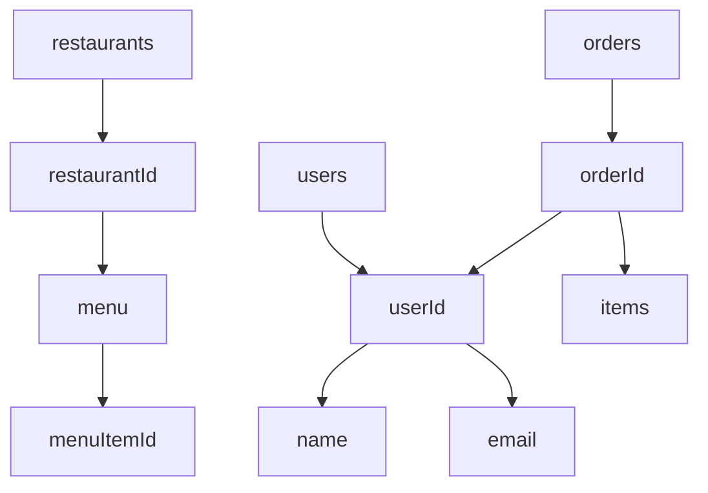

# 🚀 Firestore Database Schema Design Guide

## 📌 Overview
This project demonstrates how to design a **Firestore database schema** for scalable and efficient applications.

You will learn:
- How Firestore stores data
- How to design collections, documents, and subcollections
- How to structure scalable data
- Best practices for schema design

---

# 🧱 1. Understanding Firestore Structure

## 🔹 What is Firestore?
Firestore is a **NoSQL document-based database**.

---

## 🔹 Data Hierarchy

Firestore data is organized as:

```
Collection → Document → Fields → Subcollections
```

---

## 🔹 Components

### 📂 Collections
- Top-level containers
- Hold multiple documents

### 📄 Documents
- Store data as key-value pairs
- Have unique IDs

### 📁 Subcollections
- Nested collections inside documents
- Used for large or related data

---

## 🔹 Example Structure

```
users
 └── userId
       ├── name: "Asha"
       ├── email: "asha@example.com"
       └── posts
             └── postId
```

---

# 📊 2. Data Requirements

Before designing schema, define what your app needs.

## 🔹 Example Data Requirements

- Users  
- Profiles  
- Products  
- Reviews  
- Chat Messages  
- Orders  
- Favorites  

---

## 🔹 Key Questions

- What data will be stored?  
- How frequently will it update?  
- Will it scale to many users?  
- Should it be nested or flat?  

---

# 🏗️ 3. Firestore Schema Design

## 🎯 Example 1: Task Management App

```
users
 └── userId
       ├── name: string
       ├── email: string
       └── createdAt: timestamp

tasks
 └── taskId
       ├── title: string
       ├── description: string
       ├── isCompleted: boolean
       ├── userId: string
       └── createdAt: timestamp
```

---

## 🎯 Example 2: Food Delivery App

```
users
 └── userId
       ├── name: string
       ├── email: string
       └── address: string

restaurants
 └── restaurantId
       ├── name: string
       ├── rating: number
       └── location: string

restaurants/{restaurantId}/menu
 └── menuItemId
       ├── name: string
       ├── price: number
       └── category: string

orders
 └── orderId
       ├── userId: string
       ├── restaurantId: string
       ├── items: array
       ├── totalPrice: number
       └── status: string
```

---

## 🔹 Sample Document (users)

```json
{
  "name": "Asha",
  "email": "asha@example.com",
  "createdAt": "timestamp"
}
```

---

# 🔗 4. When to Use Subcollections

## 🔹 Use Subcollections When:

- Data grows large (e.g., chat messages)  
- Data belongs to a parent (e.g., user posts)  
- Real-time updates are needed  
- Data should not load all at once  

---

## 🔹 Example

```
users
 └── userId
       └── posts
             └── postId
```

---

## ⚠️ Avoid

- Large arrays in documents  
- Deep nesting of maps  
- Overloading a single document  

---

# 🧠 5. Field Design Best Practices

## 🔹 Naming Rules

- Use **lowerCamelCase**
- Keep names meaningful

---

## 🔹 Data Types

| Type | Example |
|------|--------|
| string | "John" |
| number | 100 |
| boolean | true |
| array | ["item1", "item2"] |
| map | { "key": "value" } |
| timestamp | server time |

---

## 🔹 Timestamps

```dart
createdAt: FieldValue.serverTimestamp()
updatedAt: FieldValue.serverTimestamp()
```

---

## 🔹 Document IDs

- Auto-generated IDs are recommended  
- Custom IDs should be unique  

---

# 📊 6. Visual Schema Diagram

## 🔹 Example (Mermaid Diagram)



---

## 🔹 Tools You Can Use

- Draw.io  
- Lucidchart  
- Figma  
- Mermaid.js  

---

# 🧪 7. Schema Validation Checklist

## ✅ Verify:

- Data structure matches app requirements  
- Scales for large data  
- Logical grouping of related data  
- Subcollections used appropriately  
- Field names consistent  
- Easy to understand  

---

# 📸 Screenshots Required

Include:
1. Firestore Console view  
2. Collections and documents  
3. Schema diagram  

---

# 🧠 Key Learnings

- Firestore is document-based  
- Collections store documents  
- Documents store fields  
- Subcollections handle large datasets  
- Proper schema improves performance  

---

# ⚠️ Common Mistakes

| Issue | Fix |
|------|-----|
| Large arrays | Use subcollections |
| Poor naming | Use consistent naming |
| Deep nesting | Keep structure flat |
| No timestamps | Add createdAt/updatedAt |

---

# 🏁 Conclusion

This project demonstrates:
- Firestore data structure  
- Schema design principles  
- Scalable database modeling  

A well-designed schema ensures:
- Better performance  
- Easier maintenance  
- Scalability for real-world apps  
